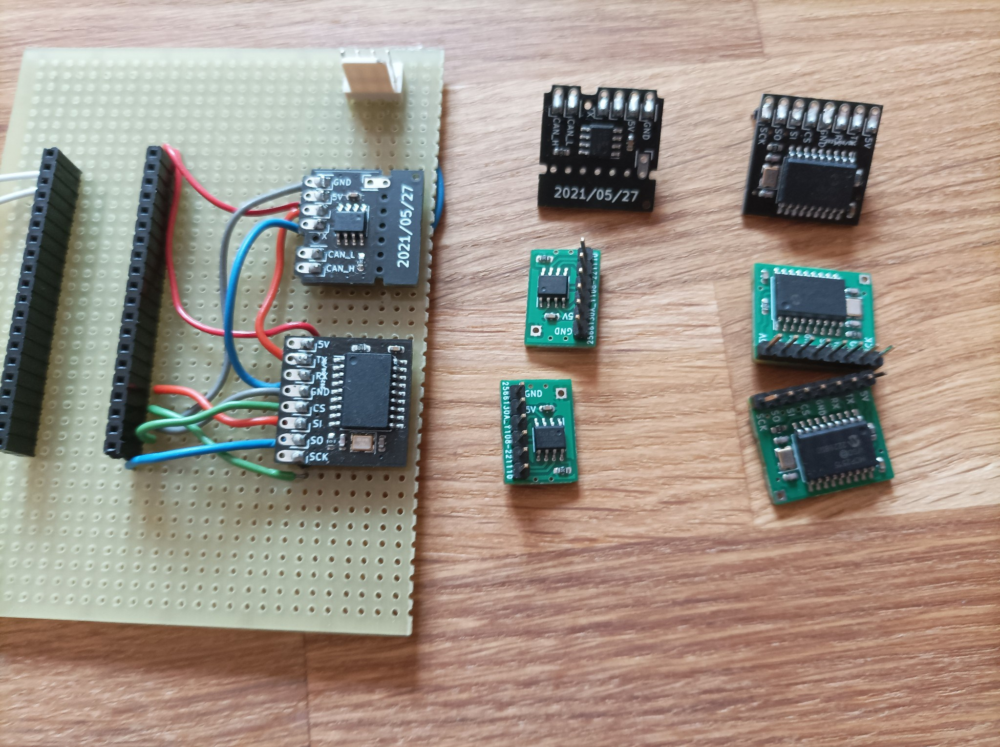
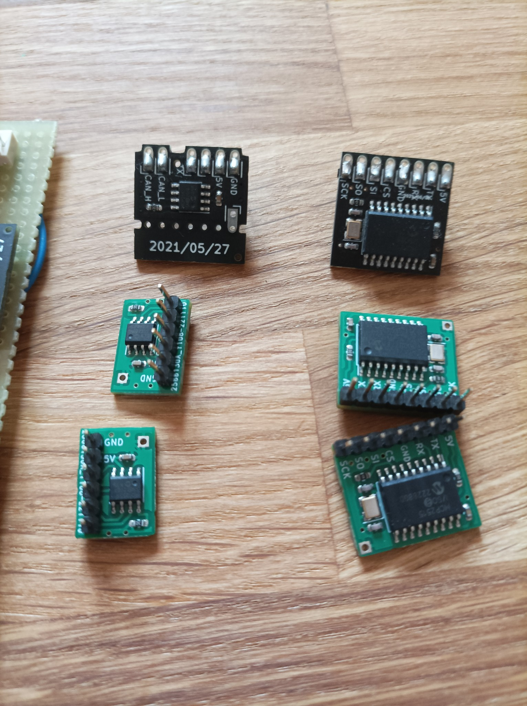
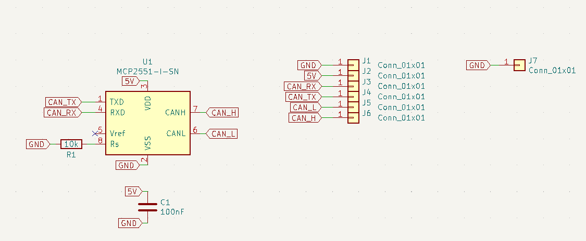
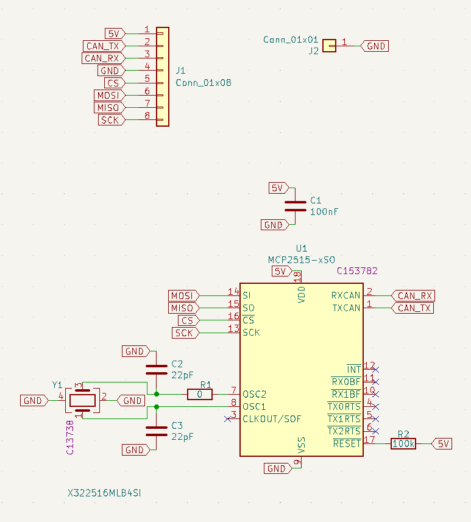

# Can controller and CAN transceiver module

Can module to easily add CAN support to anything with SPI

[Link for controller](https://github.com/Thierry-oshw/17_CAN_Controller)

[Link for transceiver](https://github.com/Thierry-oshw/15_XCAN)

## Features
- Small (Controller is 18x20 mm, Transceiver is 17x15 mm)
- Cheap (2 layer and components on one side)
- 2.54 header + castellated pad for direct board to board soldering

## Made with

- [Kicad V6](https://www.kicad.org/)

## Schematic

### 15 XCAN Schematic

### 17 CAN Controller Schematic

## Build the PCB

PCB has been fully tested on multiple projects

[CAN Controller build files](https://github.com/Thierry-oshw/17_CAN_Controller/tree/main/fabrication_2023_04_23)

[CAN Transceiver build files without castellated holes](https://github.com/Thierry-oshw/15_XCAN/tree/main/fabrication_2023_04_21)

[CAN Transceiver build files with castellated holes](https://github.com/Thierry-oshw/15_XCAN/tree/main/fabrication_2023_04_21_CH)

## Authors

- Thierry Orlandi ([Hardware Freelance](https://www.linkedin.com/in/thierry-orlandi))
- Yohann Belair ([R&D Freelance](https://github.com/ciborg971))

## License
[CERN Open Hardware Licence Version 2](https://github.com/Thierry-oshw/17_CAN_Controller/blob/main/LICENSE.txt)